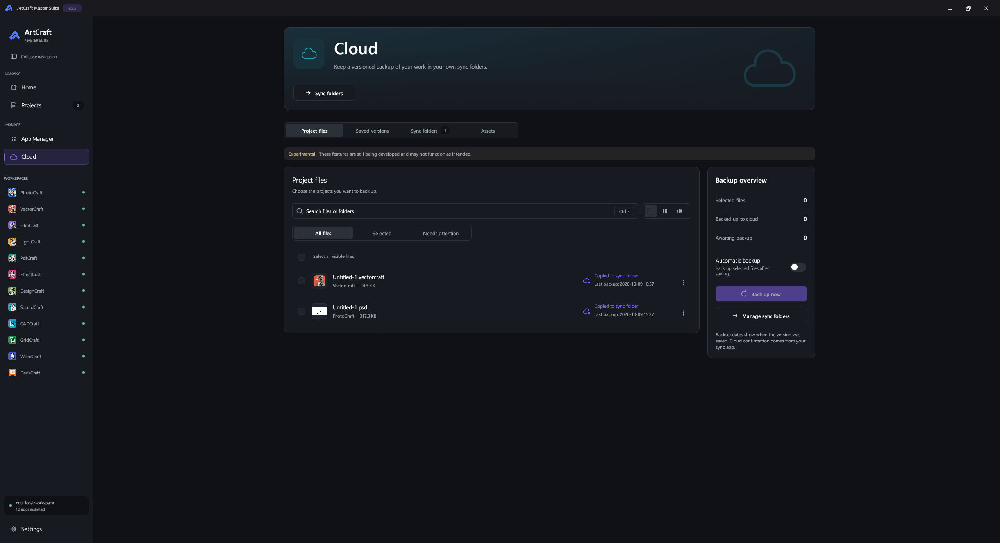
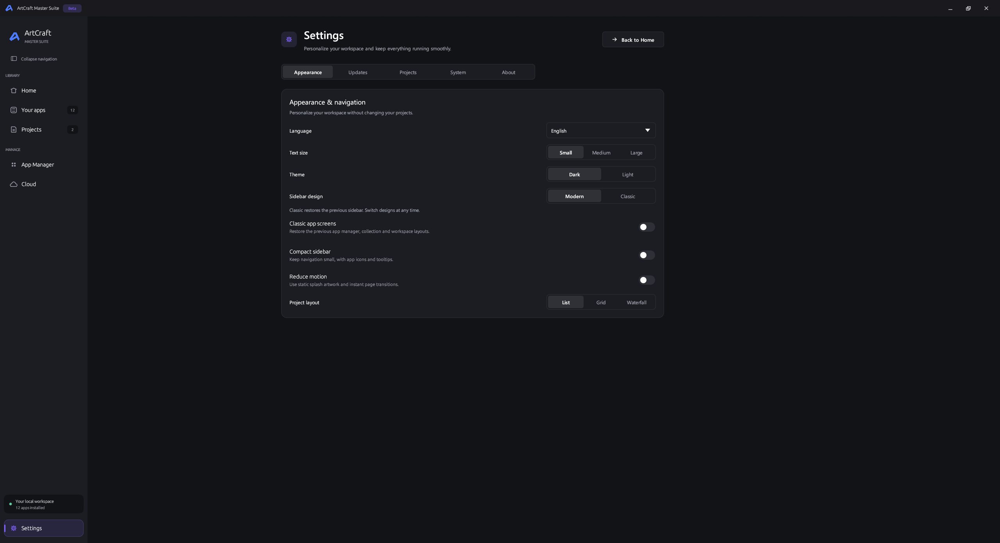

# ArtCraft Master Suite

**Your creative and office apps, projects, and backups in one desktop workspace.**

**Build 3.2 prerelease · `3.2.0-beta.1` · Windows, Linux and macOS**

[Downloads](https://github.com/ZifuM/Craft-apps-launcher-installer/releases) · [What's new in 3.2](RELEASE_NOTES_3.2.md) · [Build from source](ArtCraftLauncher-Source/README.md)

## Install

Open **[GitHub Releases](https://github.com/ZifuM/Craft-apps-launcher-installer/releases)** and choose the package for your system under **Assets**. Build 3.2 is a draft prerelease for review, with all six packages built. It becomes publicly downloadable when published; earlier releases use their original filenames.

| System | Download | Installation |
| --- | --- | --- |
| Windows x64 | `Windows-x86_64.exe` | Run the installer, then launch Master Suite from the Start menu. |
| Linux Intel/AMD | `Linux-x86_64.AppImage` or `Linux-x86_64.flatpak` | Follow the Linux steps below. |
| Linux ARM64 | `Linux-aarch64.AppImage` or `Linux-aarch64.flatpak` | Follow the Linux steps below using the ARM64 filename. |
| macOS Intel / Apple Silicon | `macOS-universal.dmg` | Open the DMG, drag **ArtCraft Master Suite.app** into Applications, then launch it. |

**Linux:** for AppImage, enable **Allow executing as a program** in file properties, then open it. For Flatpak, install Flatpak first and run `flatpak install --user ./Linux-x86_64.flatpak` from your download folder. The first installation may download its runtime. [Linux details](docs/LINUX.md)

**macOS:** requires macOS 12+. This beta is not notarized; macOS may require approval in **System Settings → Privacy & Security**. [Mac details](docs/MACOS.md)

**First launch:** choose your language and project folder, install tools through **App Manager**, then add existing work through **Projects → Add folder**. Apps download separately. Your original project files stay in their folders.

For future beta updates, enable **Settings → Updates → Allow prerelease updates**. Older suite versions may need a one-time manual upgrade to recognize the new filenames. Release assets include `SHA256SUMS.txt` for download integrity checks.

## Explore

### Home

Launch your tools, return to recent projects, and see your workspace at a glance.

### Your apps

Search installed tools and open their workspaces. Three-dot menus contain shortcuts, update checks, Properties and uninstall actions.

### Projects

Browse saved previews in List, Grid or Waterfall view. Search, favorite, rename, open or reveal files through their context menus.

### App Manager

Discover, install and update all 12 Craft apps, with links to official resources and the community.

### Cloud

Save versioned backups to Google Drive, Dropbox or OneDrive sync folders. See backup dates and status, and restore saved versions. Upload confirmation depends on the provider and platform; a local copy alone does not confirm cloud upload.

### Settings

Choose your language, text size, theme, navigation style, project layout and update preferences.

*Screenshots show the Windows interface with example apps and projects. Linux and macOS share the design, with native platform integrations.*

## More information

[Cloud setup](docs/CLOUD_SETUP.md) · [Plugins and workspace folders](docs/PLUGIN_MANAGEMENT.md) · [Release notes](RELEASE_NOTES_3.2.md) · [MIT license](ArtCraftLauncher-Source/LICENSE)

Cloud and plugin integration remain experimental; asset management is a placeholder. This is an independent community project for Storytold's ArtCraft apps. Third-party names and artwork retain their respective rights.
