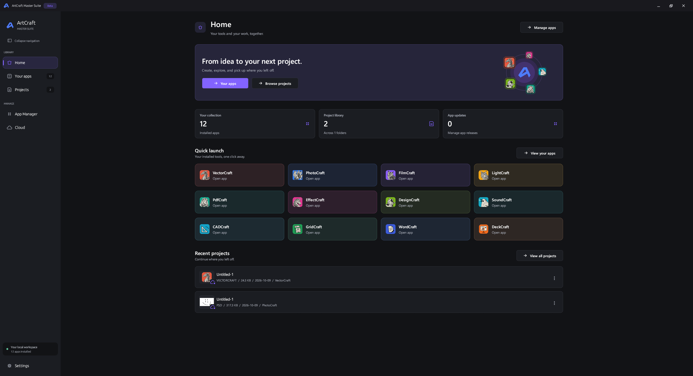
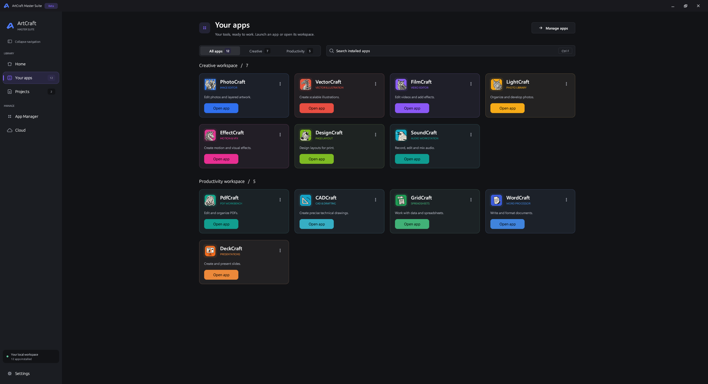
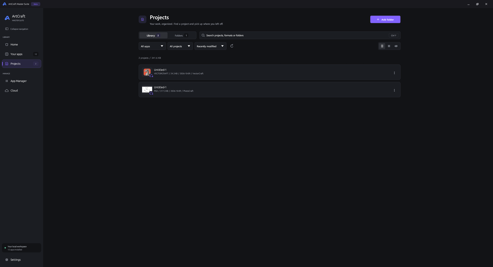
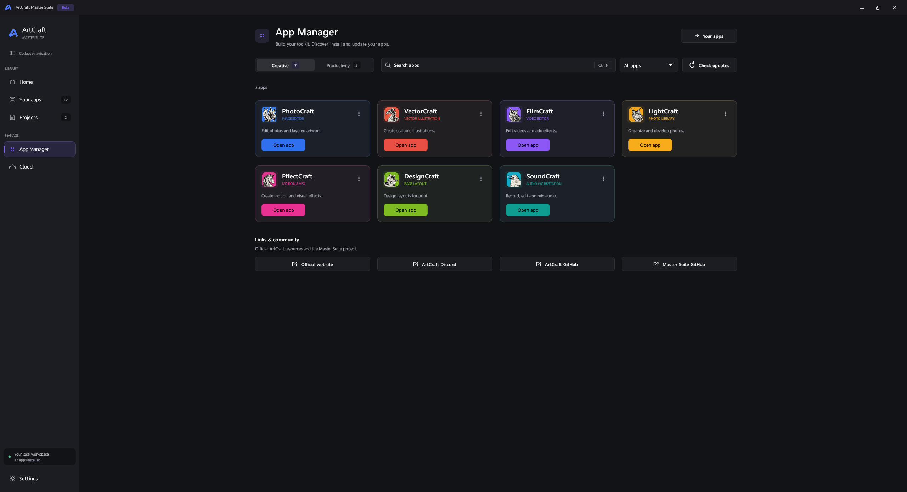

# ArtCraft Master Suite

**Your creative and productivity apps, projects, and updates in one workspace.**

**BETA · Build 3.0**

ArtCraft Master Suite is a native desktop install manager for Storytold’s ArtCraft apps. Discover tools, launch your installed apps, and pick up your saved projects from one place.

**[Downloads on GitHub Releases](https://github.com/ZifuM/Craft-apps-launcher-installer/releases)** · **[Build 3.0 release notes](RELEASE_NOTES_3.0.md)** · **[Build from source](ArtCraftLauncher-Source/README.md)**

> An independent community project, not affiliated with Adobe Inc. Third-party app names, logos, and other assets remain subject to their respective rights.

## Downloads

Get installable files from **[GitHub Releases](https://github.com/ZifuM/Craft-apps-launcher-installer/releases)**. The release workflow builds and attaches these files directly; users do not need the source archive or build tools.

| Platform | Release download |
| --- | --- |
| Windows x64 | `ArtCraftMasterSuite-Setup.exe` |
| Linux Intel/AMD 64-bit | `ArtCraftMasterSuite-Linux-x86_64.AppImage` or `ArtCraftMasterSuite-Linux-x86_64.flatpak` |
| Linux ARM64 | `ArtCraftMasterSuite-Linux-aarch64.AppImage` or `ArtCraftMasterSuite-Linux-aarch64.flatpak` |
| macOS | Not available yet |

**Build 3.0 packaging status:** the Windows installer and both Linux package formats have built successfully on GitHub and are attached to the Build 3.0 draft release. They become public when that draft is published. Linux desktop behavior still needs hands-on validation. The older installer stored in this repository is Build 2.2; use release assets for new versions.

For AppImage, allow the downloaded file to run as a program, then open it. For Flatpak, install the downloaded `.flatpak` with your software manager or `flatpak install --user ./ArtCraftMasterSuite-Linux-x86_64.flatpak` (use the ARM64 filename on ARM64). Flatpak must be installed, and initial installation may download its runtime.

Each release includes `SHA256SUMS.txt`. Linux details and limitations are in [docs/LINUX.md](docs/LINUX.md). Maintainer instructions are in [docs/RELEASING.md](docs/RELEASING.md).

## Get started on Windows

1. Download and run **ArtCraftMasterSuite-Setup.exe**. Setup installs for your Windows user and adds Start menu and desktop shortcuts.
2. On first launch, follow the setup window to choose your language, project folder, theme and Windows startup preferences. Cloud connection is optional.
3. Open **App Manager** to install the tools you want.
4. Add a folder in **Projects** to bring your saved work into the library.
5. Use **Your apps** to launch an app or enter its workspace.

Apps are installed separately. Finding releases and downloading apps requires an internet connection. Project files stay in their folders; removing a watched folder only stops indexing it.

## Explore the suite

### Home

Start with an overview of your installed apps, indexed projects, and available app updates. App-colored quick launch cards keep your tools close, with recent projects further down the page.



### Your apps

Browse only the tools installed on your PC. Search your collection, filter by Creative or Productivity, and choose **Open app** to launch directly or **Workspace** to manage that app’s projects. The collection refreshes as apps are installed or removed.



Each app workspace has three tabs:

- **Projects:** search saved work, browse previews, and switch between List, Grid, and Waterfall views.
- **Asset management:** a Coming soon layout; asset features are not implemented yet.
- **Plugin management:** experimental installation and management for compatible apps.

### Projects

Keep work from your connected folders in one searchable library. Filter by app, favorites, or recent work; sort your files; and choose List, Grid, or Waterfall view. Supported files show previews of their saved contents.

Open projects in their associated app, mark favorites, reveal files in File Explorer, rename them, or delete them with confirmation. The **Folders** tab manages connected locations and the default project folder.



### App Manager

Discover Creative and Productivity apps in separate categories. Search by name or purpose, filter installed apps or available updates, and manage installation, launch, update, and removal from app-colored cards. Up-arrow controls provide update actions.



Screenshots show an example local setup. Installed apps, project counts, and app versions vary by device.

## Supported apps

| Creative apps | Productivity apps |
| --- | --- |
| PhotoCraft — image editing | PdfCraft — PDF workbench |
| VectorCraft — vector illustration | CADCraft — CAD and drafting |
| FilmCraft — video editing | GridCraft — spreadsheets |
| LightCraft — photo library | WordCraft — word processing |
| EffectCraft — motion and VFX | DeckCraft — presentations |
| DesignCraft — page layout | |
| SoundCraft — audio | |

The current source catalog includes all 12 apps, including SoundCraft. Installation selects a published release for the operating system and CPU architecture; unavailable packages are reported instead of substituting another platform. Existing packaged builds may have an earlier catalog.

See the [source README](ArtCraftLauncher-Source/README.md) for recognized file formats, local data locations, and build instructions.

Launcher and app startup screens use a coordinated 3-second animation. During an app splash, Master Suite makes a bounded attempt to warm executable and runtime files in the disk cache; the app process starts only after the animation ends. Reduced motion keeps the artwork static.

## Make it yours

The current source groups settings into **Appearance**, **Updates**, **Projects**, **System**, and **About**. Earlier Windows builds label the System tab **Windows**.

- Choose your interface language under **Settings → Appearance → Language**. English is the default; Spanish, French, German, Portuguese, Russian, Simplified Chinese, Japanese, Korean, and Italian are also available. The choice applies immediately and is saved. Technical system errors and unavailable translations fall back to English.
- Choose **Dark** or **Light** mode, compact navigation, and reduced motion.
- Switch between **Modern** and **Classic** sidebar designs.
- Enable **Classic app screens** to restore the earlier App Manager, Your apps, and app workspace layouts. The [source backup](ArtCraftLauncher-Source/backups/app-screens-before-redesign/) is retained too.
- Set your preferred project view, connected folders, and default working folder.
- Configure app release checks from 1–24 hours and project refresh from 1–30 minutes; defaults are 4 hours and 3 minutes.
- Control persistent update notifications and automatic Master Suite updates.
- Optionally **minimize to the system tray** or **start with Windows in the tray**. Both are off by default.

Click the tray icon to reopen Master Suite, or right-click for Open and Quit. Closing the window exits; the minimize-to-tray preference applies to minimizing. Windows startup opens quietly without the splash animation.

Background checks run while Master Suite is open. Creative and productivity app updates are installed manually; Master Suite’s own automatic updates are controlled separately in **Settings → Updates**.

## Project preview support

Project cards read the last saved file, not unsaved changes in an editor. Hover over a preview to see its source. A folder icon on every project row and card reveals the file in Windows File Explorer.

| Files | Preview |
| --- | --- |
| PSD / PSB | Supported saved RGB/grayscale canvas, with embedded-thumbnail fallback |
| SVG | Rendered artwork with embedded assets; external image references are not loaded |
| PDF / PDF-compatible AI | First page rendered by Windows |
| PhotoCraft / VectorCraft / native bundles | Embedded composite, artboard preview, or thumbnail when present; empty VectorCraft artboards are recognized |
| DOCX / ODT / PPTX / XLSX | Embedded thumbnail when present; otherwise a simplified text or cell-content preview (not exact page layout) |
| TXT / Markdown / CSV / TSV | Simplified saved-content preview |
| WAV / AIFF / FLAC | Audio waveform, with bounded decoding for large recordings |
| Camera RAW | Embedded camera JPEG when readable; may not include later edits |
| DXF | Basic 2D lines, circles and straight polylines; complex entities use the Windows fallback |
| Other formats | Windows thumbnail handler when installed and available |

Film/VFX timelines, complex CAD drawings, older native projects without embedded previews, and unsupported documents may still show **Preview unavailable**. This does not mean the document is blank. Native scene/composition rendering for every app is not included. Preview loading runs in the background, and unchanged successful previews are reused during scans. Known project files are checked every two seconds for saved changes, independently of the folder-discovery interval. Changed files invalidate their cached previews; reads interrupted by a save are retried. Preview availability still depends on the saved format and its embedded content.


## Master Suite automatic updates

Starting with **2.2.0**, Master Suite checks the latest stable release from [ZifuM/Craft-apps-launcher-installer](https://github.com/ZifuM/Craft-apps-launcher-installer/releases) after startup and every four hours. Automatic suite updates are enabled by default and can be disabled in **Settings → Updates**.

A newer release is downloaded in the background, checked against its SHA-256 digest, and installed after a notification and a 10-second idle delay. App installations, launches, project scans and project-edit dialogs defer the restart. The installer waits for Master Suite to exit, replaces the application, and starts it again. Project files and preferences are retained. Failed downloads or checksum checks do not start the installer.

### Publishing a Windows update

1. Set the package version in `ArtCraftLauncher-Source/Cargo.toml` to the new version, greater than the previous release.
2. Build the launcher first, then the setup executable (setup embeds the launcher).
3. Publish a non-draft, non-prerelease GitHub Release with a matching numeric tag, such as `v2.3.0`.
4. Attach **ArtCraftMasterSuite-Setup.exe** and **SHA256SUMS.txt**. The updater prefers the direct installer. It also accepts `Windows-64bit.Installer.zip` or `ArtCraftMasterSuite-Windows-x64.zip` containing exactly one `ArtCraftMasterSuite-Setup.exe`.

The updater uses GitHub's asset SHA-256 digest when available, otherwise a matching entry in the release's SHA256SUMS.txt. For ZIP releases, the fallback checksum must cover the ZIP. Unsigned/unverified downloads are not installed when neither checksum source is available. A SHA-256 digest checks integrity; it is not an Authenticode signature.

Updating files on the repository's main branch alone does not publish an app update. Users on an older build without the self-updater must install 2.2.0 or later once to receive future automatic updates.

### Linux update packages

The Linux port selects an AppImage for the matching architecture, or the running Flatpak installation's reference, branch and configured update source. It never substitutes a Windows installer. Flatpak updates require a maintained repository; publishing a source archive or standalone bundle alone does not establish an update service. See [Linux distribution requirements](docs/LINUX.md).

## Verify the installer

Compare the installer’s SHA-256 hash with the entry in [SHA256SUMS.txt](SHA256SUMS.txt):

```powershell
Get-FileHash .\ArtCraftMasterSuite-Setup.exe -Algorithm SHA256
```

## Source and license

Source code and assets are in [ArtCraftLauncher-Source](ArtCraftLauncher-Source/). The launcher source is licensed under the [MIT License](ArtCraftLauncher-Source/LICENSE). This license does not change the rights for third-party app names, logos, or other assets.

## First-run setup and cloud backup

New installations show a four-step setup window. Existing users who have not completed setup see it once, with their current preferences preserved. English is the default, and both Windows startup and minimize-to-tray remain off by default.

The Cloud screen saves versioned copies of selected projects into folders managed by Google Drive, Dropbox or OneDrive. Sign in through the provider desktop app, then select its synced folder in **Cloud > Sync folders**. No developer registration or API key is needed. Automatic backup is off by default, and saved versions can be restored as separate local copies. Assets remain a future feature.

**Copied locally confirms a local backup, not a completed upload.** The provider desktop app handles uploads and reports their status. See [Cloud backup setup](docs/CLOUD_SETUP.md).

## Plugins and workspace folders

Install compatible PhotoCraft, VectorCraft and EffectCraft WebAssembly plugins from GitHub or a local file in each app’s Plugin management tab. Enable, disable or remove managed extensions and view their installed locations. Other plugin formats/apps need separate adapters.

Each workspace now contains `Projects`, `Exports`, `Assets` and `Plugins`. Existing files stay in place. EffectCraft’s export preference is connected to `Exports`; universal save/export defaults require integration in the Craft apps themselves. [Plugin support and integration details](docs/PLUGIN_MANAGEMENT.md).
