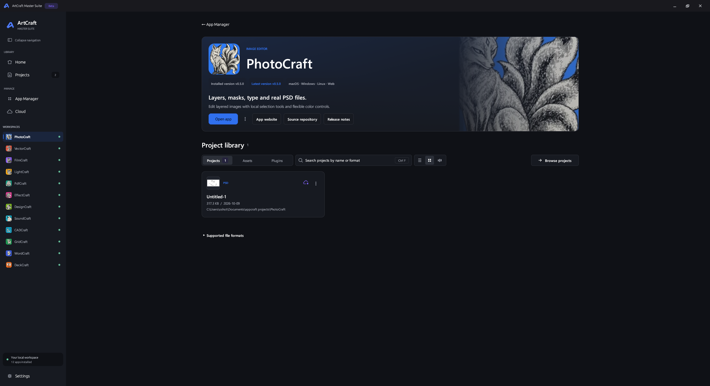

# ArtCraft Master Suite

Your Craft apps, projects and backups in one desktop workspace.

**Build 3.3 prerelease · `3.3.0-beta.1` · Windows, Linux and macOS**

[Download Build 3.3](https://github.com/ZifuM/Craft-apps-launcher-installer/releases/tag/v3.3.0-beta.1) · [Release notes](RELEASE_NOTES_3.3.md) · [Build from source](ArtCraftLauncher-Source/README.md)

## Install

Download the matching file from the release's **Assets**:

| OS | Download | Steps |
| --- | --- | --- |
| Windows x64 | `Windows-x86_64.exe` | Run the installer, then open **ArtCraft Master Suite** from Start. |
| macOS 12+ — Intel or Apple Silicon | `macOS-universal.dmg` | Open the DMG, drag the app into **Applications**, then launch it. |
| Linux Intel/AMD | `Linux-x86_64.AppImage` or `Linux-x86_64.flatpak` | Use either option below. |
| Linux ARM64 | `Linux-aarch64.AppImage` or `Linux-aarch64.flatpak` | Use either option below with the ARM64 filename. |

**Linux AppImage:** in file Properties, allow execution, then open it. Or run:

```sh
chmod +x Linux-x86_64.AppImage
./Linux-x86_64.AppImage
```

**Linux Flatpak:** with Flatpak and Flathub set up, run:

```sh
flatpak install --user ./Linux-x86_64.flatpak
flatpak run io.github.ZifuM.ArtCraftMasterSuite
```

**macOS:** this prerelease is not notarized. If macOS blocks opening it, use **System Settings → Privacy & Security → Open Anyway** for the downloaded app.

**First launch:** choose your language and project folder. Install apps through **App Manager** and add existing folders through **Projects → Add folder**. Apps download separately. Enable **Settings → Updates → Allow prerelease updates** for future betas.

## Main features

- **Home:** quick launch, recent projects and update counts.
- **App Manager:** install, update and manage 12 Craft apps.
- **Projects:** search, filters, previews, favorites and List/Grid/Waterfall views.
- **Workspaces:** app information, direct sidebar access and an app-specific project library.
- **Cloud:** versioned backups, restore, dates and status for your own sync folders.
- **Settings:** languages, text sizes, themes and navigation preferences.

## Screenshots

<details>
<summary>Home — quick launch and recent projects</summary>


</details>

<details>
<summary>Projects — search, filters and file previews</summary>


</details>

<details>
<summary>App Manager — discover, install and update apps</summary>


</details>

<details>
<summary>Cloud — versioned backups and status</summary>


</details>

<details>
<summary>Workspaces — app details and project libraries</summary>



</details>

*Screenshots show the Windows interface with example projects. All three platforms share the design.*

Cloud and plugin integration are experimental; Assets is a placeholder. A copy to a sync folder does not confirm cloud upload—your provider's client handles syncing.

[Linux details](docs/LINUX.md) · [macOS details](docs/MACOS.md) · [Cloud setup](docs/CLOUD_SETUP.md) · [License](ArtCraftLauncher-Source/LICENSE)

Independent community launcher for Storytold's ArtCraft apps. App names and artwork belong to their respective owners.
